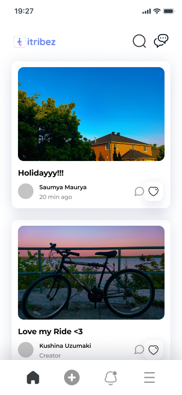
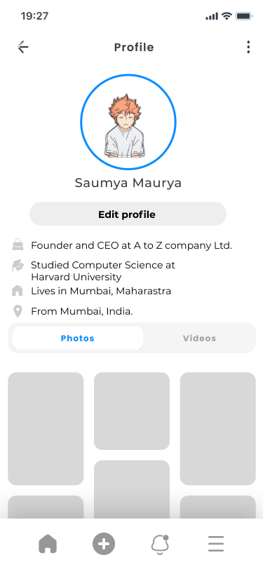
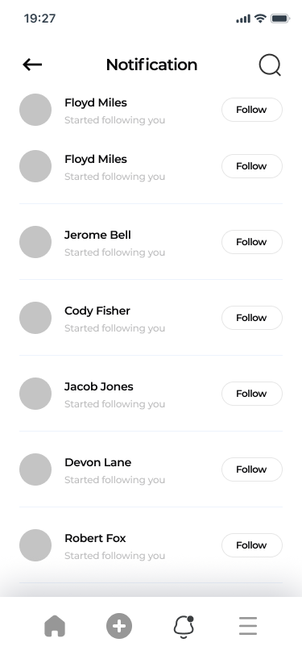
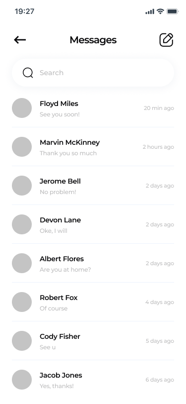

# iTribez React-Native

Itribez is a community-oriented app designed for international students and travelers.
It allows users to connect with each other, share experiences, and access information about accommodation, transportation, and more.
With features like chat, posts, and notifications, Itribez aims to create a supportive and interactive platform for users in a foreign country.

# Screenshots
Our goal is to create an app interface that resembles the screenshots of Wireframes provided, incorporating its design elements, layout, and visual aesthetics while ensuring a user-friendly and intuitive experience for international students and travelers using the Itribez app.
## Figma Link
[https://www.figma.com/file/KCC5jHkhH5axBP6AxjteLN/iTribez---Figma?type=design&node-id=227%3A421&mode=design&t=p8kv7gr5VyvkwKWe-1]

### Splash Screen

### Sign in Screen

### Create Account 

### Homepage

### Profile

### Create Post

### Notification

### Messages 

### Chats
